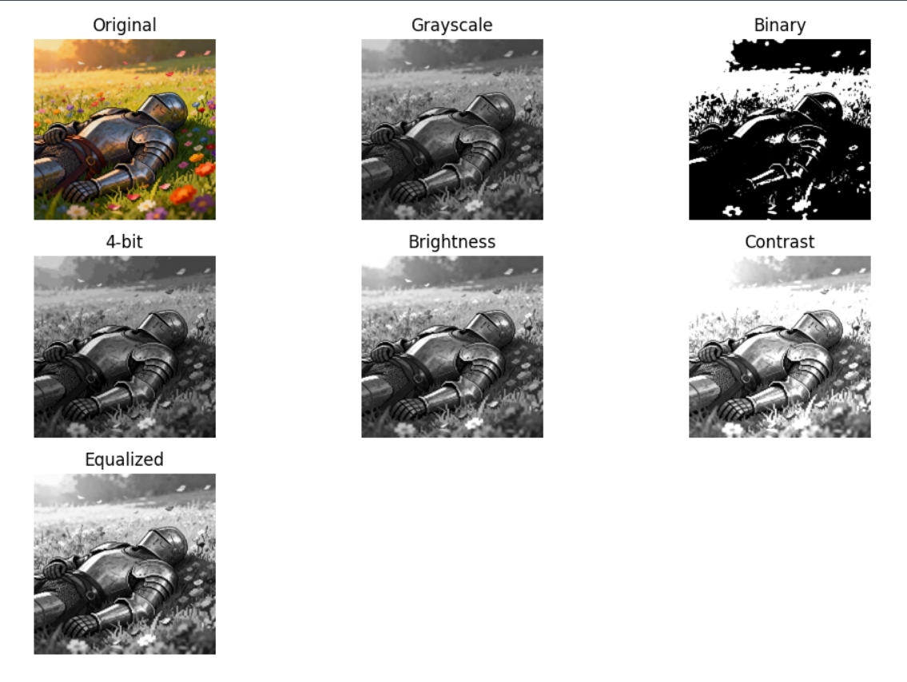

# Tugas Pengolahan Citra Digital

## 1. Pendahuluan
Proyek ini bertujuan untuk memahami dasar pengolahan citra digital menggunakan Python di Google Colab, meliputi transformasi citra dan analisis histogram.

---

## 2. Teori

### 2.1 RGB ke Grayscale
Konversi RGB ke grayscale menggunakan rumus:
Gray = 0.299R + 0.587G + 0.114B

### 2.2 Grayscale ke Biner
Thresholding digunakan untuk mengubah citra menjadi hitam putih:
- Pixel > T → putih
- Pixel ≤ T → hitam

### 2.3 Grayscale ke m-bit
Mengurangi jumlah level intensitas:
L = 2^m

### 2.4 Brightness
Menambah nilai pixel:
g(x,y) = f(x,y) + β

### 2.5 Contrast
Mengalikan nilai pixel:
g(x,y) = α f(x,y)

### 2.6 Histogram
Menunjukkan distribusi intensitas pixel dalam citra

### 2.7 Histogram Equalization
Meratakan distribusi intensitas menggunakan CDF

---

## 3. Implementasi
Program dibuat menggunakan:
- Python
- OpenCV
- NumPy
- Matplotlib

---

## 4. Hasil

Berikut hasil pengolahan citra:

---

## 5. Analisis

- Proses yang dilakukan sesuai dengan teori yang dipelajari
- Namun implementasi menggunakan OpenCV tidak dilakukan secara manual
- Library sudah mengoptimasi proses sehingga lebih cepat dan efisien
- Perbedaan utama terdapat pada detail perhitungan yang tidak terlihat oleh pengguna

---

## 6. Kesimpulan
Pengolahan citra digital dapat dilakukan dengan mudah menggunakan OpenCV, dan hasilnya sesuai dengan teori, meskipun proses internalnya tidak dilakukan secara manual.

---

## 7. Referensi
- Digital Image Processing – Gonzalez & Woods
